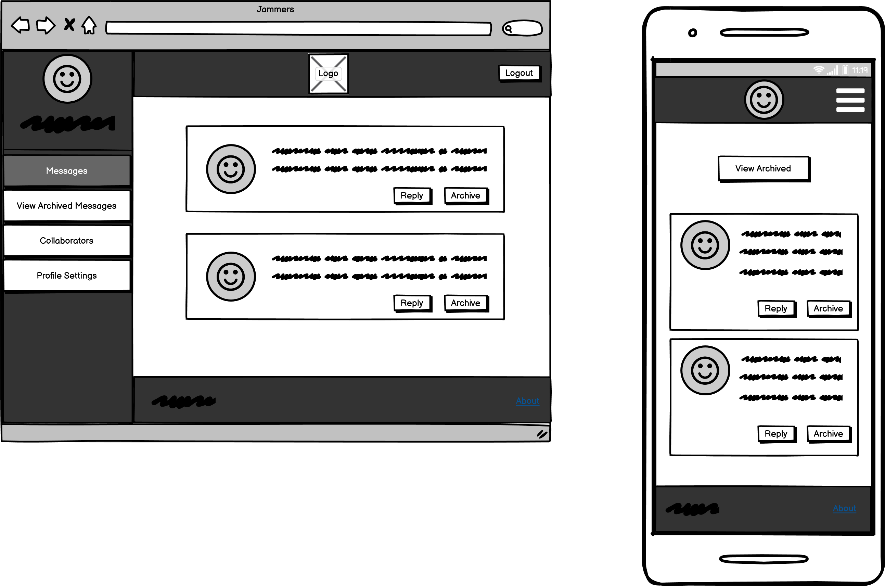
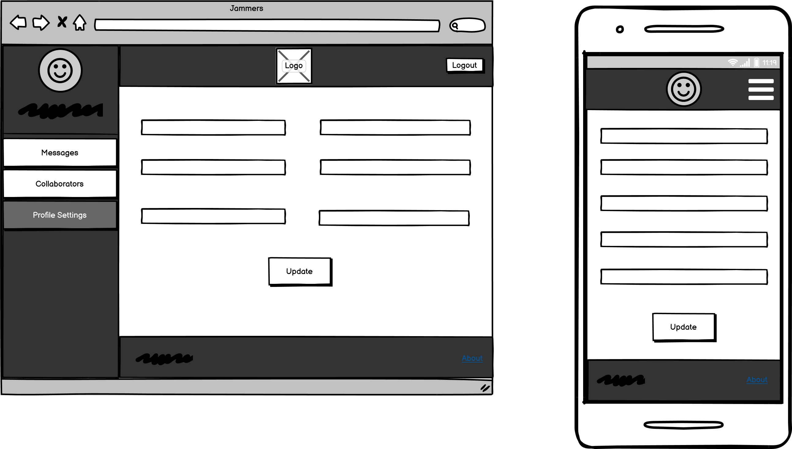
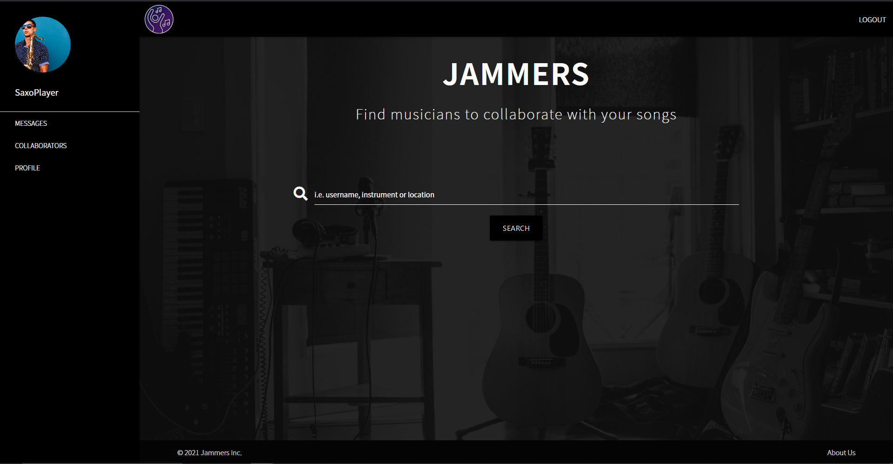

# Jammers

Jammers is a service that allows its users to collaborate online with singer / songwriters and musicians all over the world. The word 'Jammers' is derived from the verb 'To Jam', often used by musicians when they get together and play music.

At its initial stage, the service allows users to exchange messages between each other, but its ambition is to integrate a DAW (Digital Audio Workstation) on the website, which will allow users to record, edit and mix their songs on the cloud, and have other users to collaborate on their projects.

There is currently no company / service that has successfully achieved this, thus putting Jammers in a very good market position.

<div id="toc"></div>

## Table of Contents

- [1. UX](#ux)
    - [1.1 Target Audience](#1-1)
    - [1.2 User Stories](#1-2)
        - [1.2.1 First Time User Goals](#1-2-1)
        - [1.2.2 Frequent User Goals](#1-2-2)
- [2. Features](#features)
    - [2.1 Sections](#2-1)
    - [2.2 Wireframes](#2-2)
    - [2.3 Finished Product Samples](#2-3)
- [3. Technologies Used](#technologies)
    - [3.1 Languages Used](#3-1)
    - [3.2 Frameworks / Libraries / Programs Used](#3-2)
- [4. Testing](#testing)
    - [4.1 Code Validation](#4-1)
    - [4.2 Manual Testing of Buttons and Links](#4-2)
    - [4.3 Site Responsiveness](#4-3)
    - [4.4 User Stories Testing](#4-4)
    - [4.5 Bugs Encountered and Resolution Steps](#4-5)
        - [4.5.1 If the user doesn't upload a picture, nothing shows up in the profile display](#4-5-1)
        - [4.5.2 Multiple entries on 'other_instrument' input on the 'Register' section get entered on database as a single string](#4-5-2)
        - [4.5.3 Profile pictures with the same name will cause conflicts on MongoDB](#4-5-3)
        - [4.5.4 When viewing messages, they are not sorted by 'New' or by date](#4-5-4)
        - [4.5.5 When searching for multiple values on search page, only 1 shows up](#4-5-5)
        - [4.5.6 App crashes when logged user closes browser tab and opens a new one without closing the browser](#4-5-6)
    - [4.6 Open / Unresolved Bugs](#4-6)
        - [4.6.1 Sent messages don't include line breaks](#4-6-1)
        - [4.6.2 Users can find themselves on search results](#4-6-2)
- [5. MongoDB Collections](#mongo)
- [6. Deployment](#deployment)
    - [6.1 GitHub Deployment](#6-1)
    - [6.2 Heroku Deployment](#6-2)
- [7. Credits](#credits)

<div id="ux"></div>

## 1. UX
[Go to TOC](#toc)

<div id="1-1"></div>

### 1.1 Target Audience

The target audience for this service are musicians (including singer / songwriters) that are looking for other musicians to boost their creative ideas and musical compositions. The company expects its users to be 18 years or older and have at least basic computer skills.

<div id="1-2"></div>

### 1.2 User Stories

<div id="1-2-1"></div>

### 1.2.1 First Time User Goals

As a first time user, I expect the following:

* Learn more about the service
* Quickly search for members that are currently using the app
* Easily create a user profile

<div id="1-2-2"></div>

### 1.2.2 Frequent User Goals

As a frequent user, I expect the following:

* Easily log into my dashboard
* Quickly search for other users
* Be able to contact other users and keep a record of our message exchange
* Access a database containing my favourite users
* Leave feedback on another member's page
* Get some sort of confirmation when a message / feedback is successfully submitted
* Get some sort of feedback if I have no messages, no archived messages or collaborators
* Clearly know in which section of the dashboard I am
* Be immediately notified of new messages when logged in
* Edit / delete my profile
* Be able to log out

<div id="features"></div>

## 2. Features
[Go to TOC](#toc)

The main colours on the app are black, white and purple. I opted for dark colours, as these are less distracting to the user.

The main font on the website is 'Noto Sans JP', with a fallback on Sans Serif. 'Noto Sans JP' is an attractive, easy to read font.

<div id="2-1"></div>

### 2.1 Sections

This app can be split into 4 main sections:

1. Main Page

    - The main page provides the user with basic information about the service. It allows the user to register a profile, do a search on current users and look for more information regarding the company's goals.

2. Login Page

    - The login page allows registered users to easily log onto their dashboard.

3. Register Page

    - The register page displays a simple, yet elegant form that allows the visitor to create a profile.

4. User Dashboard

    - The user dashboard allows logged-in members to check their messages, view their favourite collaborators and also edit / delete their profile. The initial dashboard page allows the user to search for other members.

<div id="2-2"></div>

### 2.2 Wireframes

Wireframes can be found below for desktop and mobile design. Tablets will take the mobile design when viewed as portrait, and desktop / laptop design when viewed as landscape.

#### Main page


#### Main Page Search Results


#### Login Page


#### Register Page


#### User Dashboard


#### About Page


#### User Dashboard View Messages


#### User Dashboard View Archived Messages


#### User Dashboard Reply Message


#### User Dashboard Collaborators


#### User Dashboard Profile Settings


#### User Dashboard Edit Profile


#### User Dashboard Search Results


#### User Dashboard View Member Profile


#### User Dashboard About Page


#### View Member Profile (Unregistered / Logged Out User)


<div id="2-3"></div>

### 2.3 Finished Product Samples

#### Main Page


#### User Dashboard



<div id="technologies"></div>

## 3. Technologies Used
[Go to TOC](#toc)

<div id="3-1"></div>

### 3.1 Languages Used

The following languages were used on this app:

* HTML
* CSS
* Javascript
* Python

<div id="3-2"></div>

### 3.2 Frameworks / Libraries / Programs Used

The following were used on the development of this app:

* [Flask 2.0.1](https://flask.palletsprojects.com/en/2.0.x/)

    A lightweight WSGI web application framework for Python.

* [Materialize 1.0.0](https://materializecss.com/)

    A CSS responsive front-end framework.

* [JQuery 3.6.0](https://jquery.com/)

    Used in conjunction with Materialize and also to autoresize textboxes in modals.

* [Google Fonts](https://fonts.google.com)

    The app's main font ('Noto Sans JP') was taken from Google Fonts.

* [Font Awesome 5.15.3](https://fontawesome.com/)

    All icons (except logo icon) on the website derive from Font Awesome.

* [Freelogo Design](https://editor.freelogodesign.org/)

    Used to create the logo for the website.

* [Unsplash](https://unsplash.com/)

    Background Hero Image and user profile pictures were taken from website Unsplash.

* [Balsamiq](https://balsamiq.com/)

    Used to create wireframes.

<div id="testing"></div>

## 4. Testing
[Go to TOC](#toc)

The website was tested on the following browsers, all displaying similar behaviour:

* Mozilla Firefox (v 90.0.2)
* Google Chrome (v 92.0.4515.107)
* Microsoft Edge (v 92.0.902.55)

For mobile, I used an Asus Zenphone 5, Android version 9. The following browsers were used for testing:

* Mozilla Firefox (v 90.1.2)
* Google Chrome (v 91.0.4472.120)

<div id="4-1"></div>

### 4.1 Code Validation

| Test | Outcome | Pass / Fail |
| :--: | :-----: | :---------: |
| Ensure code passes [HTML Validator](https://validator.w3.org/) | Because the HTML validator doesn't recognize Jinja code, it is not possible to copy-paste the code straight into the validator, as this will result in errors. To work around this, I validated each page by passing the URL, instead of the actual code ([example here](wireframes/html_validator.png)). Alternatively, it is also possible to load each page on Firefox, right click on the page and select 'View Page Source'. This will open a new window with the HTML code. You can then copy-paste that code into the validator to check for warnings / errors. No issues found on the HTML code. | Pass |
| Ensure code passes [CSS Validator](https://jigsaw.w3.org/css-validator/) | No errors found on `styles.css`. | Pass |
| Ensure code passes [JS Validator](https://jshint.com/) | No issues found on file `script.js`. The file `autocomplete.js` came up with the following warning: 'Functions declared within loops referencing an outer scoped variable may lead to confusing semantics. (inp, closeAllLists)'. This does not affect the app. | Pass |
| Ensure code passes [Python Validator](http://pep8online.com/) | No issues found on `app.py`. | Pass |

<div id="4-2"></div>

### 4.2 Manual Testing of Buttons and Links

Manually tested all buttons and links on the app, they behave as expected: trigger the correct URL and / or trigger CRUD functionalities. More details can be found on the below table.

| Button / Link | Expected Result | Pass / Fail |
| :----: | :-------------: | :---------: |
| Search button | Display results based on a visitor / registered member's search. Trigger POST methods of `intro_search()` or `dashboard_search()` on `app.py` | Pass |
| Login nav link | Trigger GET method of `login()` on `app.py` | Pass |
| Register nav link | Trigger GET method of `register()` on `app.py` | Pass |
| 'About Us' link | Start `about()` on `app.py` | Pass |
| Logo mainpage link | Depending if the user is logged in or not, start `main()` or `user_dashboard` on `app.py` | Pass |
| Login button | Trigger POST method on `login()` on `app.py` | Pass |
| Register button | Trigger POST method on `register()` on `app.py` | Pass |
| Messages nav link | Start `get_messages()` on `app.py` & reveal 'View Archived Messages' link when active | Pass |
| Reply link on each user message | Trigger GET method of `view_message(message_id)` on `app.py` | Pass |
| Archive link on each user message | Start `archive_message(message_id)` on `app.py` | Pass |
| Send button on reply message | Trigger POST method of `view_message(message_id)` on `app.py` | Pass |
| View Archived Messages nav link | Trigger `view_archived()` on `app.py` | Pass |
| Reply link on archived message | Trigger GET method of `view_message(message_id)` on `app.py` | Pass |
| Unarchive link on archived message | Start `unarchive_message(archive_id)` on `app.py` | Pass |
| Delete link on archived message | Start `delete_message(archive_id)` on `app.py` | Pass |
| Collaborators nav link | Trigger `view_collaborators()` on `app.py` | Pass |
| Message link on 'collaborators.html' | Open Message modal | Pass |
| Remove link on 'collaborators.html' | Open Remove modal | Pass |
| Send Message button on Message modal on 'collaborators.html' | Trigger POST method on `send_message(profile_id)` on `app.py` | Pass |
| Cancel button on Remove modal on 'collaborators.html' | Close Remove modal | Pass |
| Delete link on Remove modal on 'collaborators.html' | Trigger `remove_collaborator(profile_id)` on `app.py` | Pass |
| Profile nav link | Trigger `user_profile()` on `app.py` | Pass |
| Edit link on 'view_user_profile.html' | Trigger GET method on `edit_profile()` on `app.py` | Pass |
| Delete link on 'view_user_profile.html' | Open Delete Profile modal | Pass |
| Update button on 'edit_profile.html' | Trigger POST method on `edit_profile()` on `app.py` | Pass |
| Cancel button on Delete Profile modal on 'view_user_profile.html' | Close Delete Profile modal | Pass |
| Delete Profile link on Delete Profile modal on 'view_user_profile.html' | Trigger `delete_profile()` on `app.py` | Pass |
| User thumbnail link on 'intro_search.html' | Trigger `view_profile(user_id)` on `app.py` | Pass |
| User thumbnail link on 'dashboard_search.html' | Trigger `dashboard_view_user(profile_id)` on `app.py` | Pass |
| Message link on 'dashboard_view_user.html' | Open Message modal | Pass !
| Send Message button on Message modal on 'dashboard_view_user.html' | Trigger POST method of `send_message(profile_id)` on `app.py` | Pass |
| Feedback link on 'dashboard_view_user.html' | Open Feedback modal | Pass |
| Post Feedback button on Feedback modal on 'dashboard_view_user.html' | Trigger POST method of `post_feedback(profile_id)` on `app.py` | Pass |
| Add to Collaborators link on 'dashboard_view_user.html' | Trigger `add_collaborator(profile_id)` on `app.py` | Pass |
| Remove from Collaborators link on 'dashboard_view_user.html' | Start `remove_collaborator(profile_id)` on `app.py` | Pass |


All functionalities related to buttons and links are encapsulated within Python 'try / except' blocks, so if the code fails the 'try' block, the user is sent to the main page. I tested this by doing two things:

* Purposely write faulty syntax and see how the code behaves.

    For example, on the following code:

    ```
    @app.route('/dashboard')
    def user_dashboard():
        try:
            user = mongo.db.users.find_one({'username': session['user']})
            new_messages = check_new_messages()
        except:
            render_error()
            return render_template('intro.html')
        else:
            return render_template(
                'profile_main.html', user=user, new_messages=new_messages)
    ```

    I changed the `check_new_messages()` function to `chek_new_messages()`. This causes an error, which triggers the except block, leading the user to the main page with a message stating 'Internal error, please try again later!'

* Simulate a database communication failure, by using a database collection that doesn't exist.

    Using the same code as above, I changed `mongo.db.users.find_one({'username': session['user']})` to `mongo.db.userss.find_one({'username': session['user']})`. Because the collection 'userss' doesn't exist, an error is triggered and the code within the except block runs successfully.

<div id="4-3"></div>

### 4.3 Site Responsiveness

The following resolutions were tested on Firefox's 'Responsive Design Mode' tool:

* 360x740 (landscape mode all well)
* 375x667 (landscape mode all well)
* 375x812 (landscape mode all well)
* 411x823 (landscape mode all well)
* 414x736 (landscape mode all well)
* 768x1024 (landscape mode all well)
* 800x1280 (landscape mode all well)
* 834x1112 (landscape mode all well)
* 1024x1366 (landscape mode all well)
* 1440x900
* 1280x720
* 1920x1080

No issues found on the above mentioned resolutions.

<div id="4-4"></div>

### 4.4 User Stories Testing

1. First time user goals

    - Learn more about the service

        - The text on the main page ('Find musicians to collaborate with your songs') explains the visitor the main purpose of the app's service.

        - The 'About' [page](wireframes/about_screenshot.png) provides the user with more information regarding Jammers' current and future goals.

    - Quickly search for members that are currently using the app

        - The search function on the intro page allows visitors to search for current members either by username, instrument or location. Search words are not exclusive, so, for example, if one types 'saxophone, london', the results page will display all users that play saxophone and all users that live in a city called London - see example [here](wireframes/search_results_screenshot.png). The visitor is also allowed to click on a member's [profile](wireframes/user_profile_screenshot.png) to view more information. The visitor cannot message or leave feedback back on a member's profile, this functionality is reserved for registered users.

    - Easily create a user profile

        - The visitor can click on the 'Register' page, which will lead the user to an easy to submit form.

2. Frequent user goals

    - Easily log into my dashboard

        - The user can click on the 'Login' button on the intro page. This will lead the user to a page asking for the username and password. If both fields are correct, the user can then access his dashboard. If the credentials are wrong, the user will be notified that either the username or password are [incorrect](wireframes/invalid_credentials.png).

    - Quickly search for other users

        - The main dashboard page allows the user to search for current members either by username, instrument or location. Search words are not exclusive, so, for example, if one types 'saxophone, london', the results page will display all users that play saxophone and all users that live in a city called London - see example [here](wireframes/dashboard_search_results_screenshot.png). The user is able to click on another member's [profile](wireframes/dashboard_user_profile_screenshot.png) to view more information.

    - Be able to contact other users and keep a record of our message exchange

        - The user can contact another member by clicking on the member's profile and then click the 'Message' button. This will bring up a modal that allows the user to write a message - see example [here](wireframes/send_message_screenshot.png).

        - If the member is on the user's 'Collaborators' database, the user can access that database and message the member from there by clicking on the 'Message' button attached to that member's thumbnail - see example [here](wireframes/message_via_collaborators_screenshot.png).

        - The 'Messages' button on the user's dashboard allows the user to access new and old [messages](wireframes/messages_screenshot.png). The 'Reply' button on each message allows the user to reply to the message and also keep track of the entire conversation [history](wireframes/reply_screenshot.png).

    - Access a database containing my favourite users

        - The dashboard contains a section entitled 'Collaborators' that allows a user to access his favoutire musicians / collaborators. To add a member to the 'Collaborators' database, the user needs to click on a member's profile and then click the 'Add to Collaborators' button.

        - The 'Collaborators' section has some basic management functionality. The user can message a member or remove them as a collaborator - see example [here](wireframes/collaborators_screenshot.png). It is also possible to remove someone as a collaborator by accessing the member's profile and click the 'Remove from Collaborators' button (only visible if the member is a collaborator).

    - Leave feedback on another member's page

        - This can be done by clicking on a member's profile and then the 'Feedback' button. A modal window pops up, allowing the user to write [feedback](wireframes/feedback_screenshot.png) on someone else. The feedback then appears in the lower section of the profile page.

    - Get some sort of confirmation when a message / feedback is successfully submitted

        - Whenever a user submits a message or feedback, if it is successfull, a message is displayed on top of the screen. This is done via Flash messages on certain functions on app.py. For example, the below code on `send_message()` displays a comment on top of the webpage, whenever a message is sent successfully:

        ```
        flash('Message sent!', 'info')
        return redirect(
            url_for('dashboard_view_user', profile_id=profile_id))
        ``` 

    - Get some sort of feedback if I have no messages, no archived messages or collaborators

        - If a user has no messages, no archived messages or collaborators, a flash message will display on screen confirming this. An example is the code on `view_collaborators()`:

        ```
        if len(collabs) == 0:
            flash('You have 0 collaborators. Search and add users!',
                'info')
            return render_template(
                'collaborators.html',
                user=user,
                new_messages=new_messages)
        else:
            return render_template(
                'collaborators.html',
                user=user,
                collabs=collabs,
                new_messages=new_messages)
        ```
    
    - Clearly know in which section of the dashboard I am

        - Whenever users click one of the sidenav buttons, that button becomes active (highlighted in purple, until users click another button), giving them a clear indication of which section they're [at](wireframes/collaborators_screenshot.png).

    - Be immediately notified of new messages when logged in

        - When a user logs in, a blue badge pops up on the right hand side of the 'Messages' button alerting if and how many new messages the user has. The badge only appears if new messages are available. The function `check_new_messages()` on app.py runs everytime the user navigates to a different section / subsection, so the user doesn't need to navigate back to 'Messages' to find out if new messages are available.

    - Edit / delete my profile

        - The user dashboard has a section called ['Profile'](wireframes/profile_settings_screenshot.png) that allows users to view, edit and delete their profiles.

        - Clicking the 'Edit' button under 'Profile' will lead the user to an Edit Profile page. This [page](wireframes/edit_profile_screenshot.png) is very similar to the Register page, allowing the user to alter most of the current details.

        -  The 'Delete' button under 'Profile' will delete the user's profile. Once [clicked](wireframes/delete_profile_screenshot.png), a modal window pops up, requesting confirmation from the user.

    - Be able to log out

        - This is done by clicking the 'Logout' button on the top right corner of the screen. Clicking this button will terminate the user's session and lead them back to the main page.

<div id="4-5"></div>

### 4.5 Bugs Encountered and Resolution Steps

<div id="4-5-1"></div>

### 4.5.1 If the user doesn't upload a picture, nothing shows up in the profile display

To avoid the above, a generic picture has been uploaded to the MongoDB 'jammers' database, under the 'fs.chunks' and 'fs.files' collections: 'generic_profile_pic.jpg'.

If the user doesn't upload a picture, the code under `register()` and `edit_profile()` in app.py will assign 'generic_profile_pic.jpg' as the user's profile [picture](wireframes/generic_profile_pic_screenshot.png). Example code under `register()`:

```
if 'profile_pic' in request.files:
    profile_pic = request.files['profile_pic']
    if profile_pic.filename == '':
        profile_pic_name = 'generic_profile_pic.jpg'
    else:
        profile_pic_name = (
            f"{request.form.get('username')}{profile_pic.filename}")

        mongo.save_file(profile_pic_name, profile_pic)
```

<div id="4-5-2"></div>

### 4.5.2 Multiple entries on 'other_instrument' input on the 'Register' section get entered on database as a single string

If a user types in "Violin, Cello" for example, if gets entered in the 'users' collection in MongoDB as "violin, cello". To solve this, code was added to the `register()` and `edit_profile()` functions that splits the string and sends multiple entries to MongoDB. Code example for `register()`:

```
# Create a list of instruments
instruments = request.form.getlist('instrument')

# Check if other instruments are available
# and add them to instruments list
if request.form.get('other_instrument'):
    other_instruments_str = request.form.get('other_instrument')
    if ', ' in other_instruments_str:
        other_instruments_lst = list(other_instruments_str.split(', '))
        for item in other_instruments_lst:
            instruments.append(item.lower())
    elif ',' in other_instruments_str:
        other_instruments_lst = list(other_instruments_str.split(','))
        for item in other_instruments_lst:
            instruments.append(item.lower())
    else:
        instruments.append(other_instruments_str.lower())
```

The caveat is that the user needs to use commas to separate multiple values. I thought about adding a condition for spaces, but this will add complications on its own. For example, a user may want to write "Various ethnic instruments" or even simpler "Acoustic Guitar". To ensure the use of commas, the following comment was added to the 'other_instrument' input label: "Other instruments (separate with a comma)".

<div id="4-5-3"></div>

### 4.5.3 Profile pictures with the same name will cause conflicts on MongoDB

There may be occasions where multiple users upload a profile picture with the same name (for example, two users may upload a picture called 'profile.jpg'). This will cause a conflict on the database and some users will not see their profile picture displayed correctly.

To avoid this, each file needs to have a unique name. In this case, we're adding the username to the file's original name:

```
profile_pic_name = (
    f"{request.form.get('username')}{profile_pic.filename}")
```

<div id="4-5-4"></div>

### 4.5.4 When viewing messages, they are not sorted by 'New' or by date

If users click the 'Messages' section, messages are not sorted out properly. This was fixed with the following code on `get_messages()`:

```
messages = list(mongo.db.messages.find(
    {'to_user': session['user'], 'is_archived': False}))

messages = sorted(messages, key=lambda
                    k: (k['is_new'], datetime.strptime(k['date_created'],
                        '%d/%m/%Y %H:%M')),
                    reverse=True)
```

A similar approach was also used on `view_archived()` where messages are sorted by date.

<div id="4-5-5"></div>

### 4.5.5 When searching for multiple values on search page, only 1 shows up

If a user searches for 'violin, saxophone' for example and both values are definitely present on the database, only violin will show up. This is because of the order on the conditional logic for this code. The first condition splits the string by ',' so this means that 'violin, saxophone' will become 'violin' & ' saxophone'. The second value will end up with a space (' saxophone'), which returns nothing. This was fixed by changing the order of the logic:

```
if ', ' in search_query:
    search_query_lst = list(search_query.split(', '))
elif ',' in search_query:
    search_query_lst = list(search_query.split(','))
elif ' ' in search_query:
    search_query_lst = list(search_query.split(' '))
```

<div id="4-5-6"></div>

### 4.5.6 App crashes when logged user closes browser tab and opens a new one without closing the browser

The Flask session by default terminates when the browser is closed. However, the same is not true when only the tab is closed. This is causing the app to crash, because if a logged user closes a tab, opens a new tab (without closing the browser) and navigates to the main page, 'base.html' will detect a session 'user', but will not find the 'user' variable (see 'user dashboard' jinja code in 'base.html').

This was fixed by adding an 'if' statement under `main()`:

```
if 'user' in session:
    return redirect(url_for('user_dashboard'))
else:
    return render_template('intro.html')
```
<div id="4-6"></div>

### 4.6 Open / Unresolved Bugs

<div id="4-6-1"></div>

### 4.6.1 Sent messages don't include line breaks

If a user sends messages with line breaks, those line breaks aren't returned from the database. For example, if a user writes:

"Hi!

How are you?"

The following is returned: "Hi! How are you?"

More research needs to be done, in order to understand why this is happening.

<div id="4-6-2"></div>

### 4.6.2 Users can find themselves on search results

At the moment, users are able to find their own profile on search results, message themselves, add themselves as collaborators and also give feedback on themselves. More code needs to be written to prevent this.

<div id="mongo"></div>

## 5. MongoDB Collections
[Go to TOC](#toc)

For this project I used 3 collections:

* users
* messages
* collaborators

The schema for 'users' documents is:
```
_id: ObjectId

first_name: string

last_name: string

username: string

password: string

city: string

country: string

profile_pic: string

intruments: array

about: string

feedback: array
```

The schema for 'messages' is:
```
_id: ObjectId

date_created: string

to_user: string

from_user: string

to_user_image: string

from_user_image: string

message_list: array

latest_message: string

is_new: boolean

is_archived: boolean

related_message_id: ObjectId
```

For 'collaborators', the document model is:
```
_id: ObjectId

user: string

collaborations: array
```

Aside from the collections mentioned above, this database also contains two other collections ('fs.chunks' & 'fs.files'), which are automatically created by MongoDB to store / reference files (in this case, pictures users may upload).

<div id="deployment"></div>

## 6. Deployment
[Go to TOC](#toc)

This project was deployed to GitHub and Heroku.

<div id="6-1"></div>

### 6.1 GitHub Deployment

* Login to your GitHub account and create a new repository.
* Create a workspace based on your new repository by clicking the GitPod Online IDE browser extension.
* Create files and write code on GitPod.
* Add, commit and push your files / code to your GitHub repository using Git commands on GitPod's Terminal window. As best practice, don't forget to add to '.gitignore' assets you don't want to commit (i.e. in this case `env.py` and `__pycache__`).
* When you close your browser, it is easy to return to your Gitpod workspace. You can simply click GitPod on your browser extensions - this will take you to your workspaces menu and you can choose the workspace you were previously working on.
* If you have local files that need to be uploaded to your repository, you can drag 'n' drop them onto your GitPod workspace and then commit them to your GitHub repository.

<div id="6-2"></div>

### 6.2 Heroku Deployment

* Login to your Heroku account.
* On the top right corner, click 'New' > 'Create new app'.
* Give your app a name and choose the appropriate region.
* Click 'Create app'.
* Click on the 'Settings' tab and then on 'Reveal Config Vars'.
* Under 'Config Vars', you'll need to create the same settings as you have on your 'env.py' file (in this case, 'IP', 'PORT', 'SECRET_KEY', 'MONGO_DBNAME' and 'MONGO_URI').
* Under the same tab, scroll further down to 'Domains' to find out your domain name.
* If you haven't done so yet, create a Procfile and deploy it to your GitHub repository.
* If you haven't done so yet, create a `requirements.txt` file and deploy it to your GitHub repository. You can run the following command to create the text file: pip3 freeze --local > requirements.txt
* Under the 'Deploy' tab, locate the 'Deployment method' section and click the 'GitHub' option. Log onto GitHub if prompted, then type the name of your repository and click 'Search'. Locate your repository under the search results and click 'Connect'.
* Scroll down to 'Manual deploy', select the branch containing your project and then click 'Deploy Branch'.
* You can then click on 'Enable Automatic Deploys' if you want your Heroku repository to automatically sync with your GitHub repository, whenever you update your code on GitHub (make sure you have the correct branch selected under 'Automatic deploys'). 

<div id="credits"></div>

## 7. Credits
[Go to TOC](#toc)

The following webpages were directly used or served as an inspiration for this project:

* This article taught me how to pass categories when using Flash: https://blog.teclado.com/flashing-messages-with-flask/

* The following article helped me to create autoresize textareas that I used on my modal windows: https://www.geeksforgeeks.org/how-to-create-auto-resize-textarea-using-javascript-jquery/

* The code on this JS tutorial was used on my project as an autocomplete function for the 'country' input on the Register page: https://www.w3schools.com/howto/howto_js_autocomplete.asp

* This video tutorial by 'Pretty Printed' on YouTube taught me how to upload images to MongoDB using Flask: https://www.youtube.com/watch?v=DsgAuceHha4

*`README.md` written by Davide Correia, 2021*